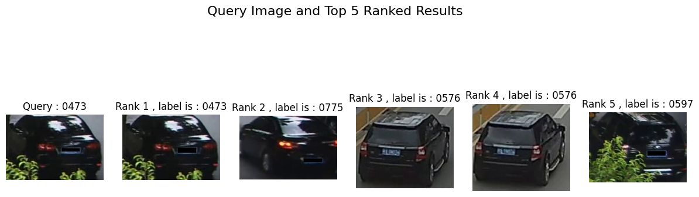
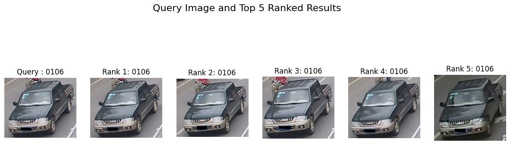
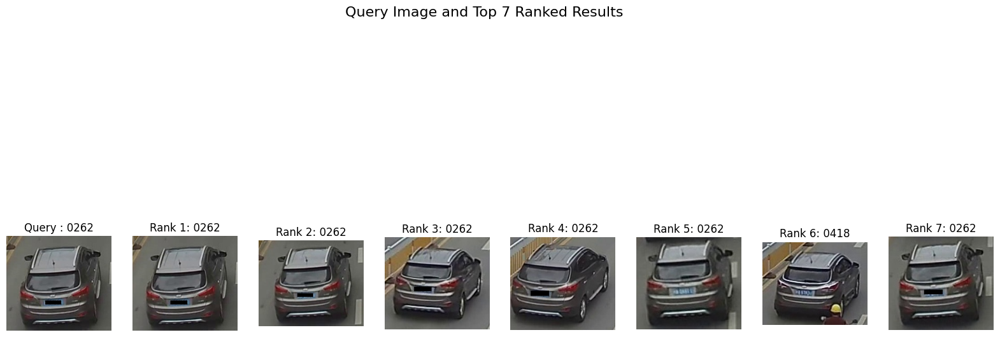

# Vehicle Re-Identification Using the VeRi Dataset

## Abstract
This project aims to develop and evaluate a vehicle re-identification system using the VeRi dataset. Leveraging a pre-trained ResNet50 architecture and triplet loss, we designed a system to learn embeddings for vehicle images. Two triplet mining strategies—random and semi-hard—were implemented and evaluated based on Mean Average Precision (mAP) and qualitative visualizations.

---

## Dataset and Preprocessing

The VeRi dataset comprises images labeled by vehicle IDs, divided into train, test, and query sets. Preprocessing steps included:
- Parsing XML annotation files to extract image-label mappings.
- Grouping images by vehicle ID for triplet generation.
- Resizing images to 224x224 and normalizing using ImageNet statistics.

A custom dataset class was implemented to facilitate image-label tensor creation for training and evaluation.

---

## Model Architecture

The base model was a ResNet50 with:
- Pre-trained weights for feature extraction.
- A custom 256-dimensional embedding layer as the final output.

---

## Triplet Mining Strategies

### Random Offline Triplet Mining
1. Generated 37,000 triplets (anchor, positive, and negative samples).
2. Randomly sampled 10,000 triplets for training.
3. Trained for 10 epochs with a batch size of 64 triplets.

### Semi-Hard Online Triplet Mining
1. Grouped images by vehicle ID for efficient sampling.
2. Custom sampler generated batches of \( P \) identities with \( K \) images each (e.g., \( P=4, K=4 \)).
3. Selected semi-hard negatives based on pairwise distances.
4. Trained two models:
   - Model 1: \( P=4, K=4 \), 20 epochs.
   - Model 2: \( P=8, K=4 \), 50 epochs.

---

## Training Setup

### Loss Function
- Triplet Loss: \( \text{Loss} = \max(0, \text{dist}_{\text{pos}} - \text{dist}_{\text{neg}} + \alpha) \)
- Margin (α): 0.3.

### Hyperparameters
- Optimizer: Adam with a learning rate of \( 1 \times 10^{-4} \).
- Device: GPU acceleration.

---

## Evaluation

### Quantitative Evaluation
- Mean Average Precision (mAP):
  - Random Triplet Mining: mAP = 0.1733.
  - Semi-Hard Mining (\( P=4, K=4 \)): mAP = 0.3621.

### Qualitative Evaluation
- Visualizations of top-ranked test images for selected query images.

#### Random Triplet Mining Visualization

#### Semi-Hard Mining Visualization (P=4, K=4)

#### Bigger Semi-Hard Mining Visualization (P=8, K=4)

---

## Conclusion

Semi-hard triplet mining significantly outperformed random mining. Informative triplet selection improved embedding quality and model performance. Increasing batch size in semi-hard mining further enhanced results. Future work can explore:
- Fine-tuning ResNet for domain-specific features.
- Incorporating attention mechanisms for better localization.
- Extending evaluations to other datasets.

---

## How to Use
1. Preprocess the VeRi dataset as described.
2. Train the model using random or semi-hard triplet mining.
3. Evaluate using the provided mAP and visualization functions.

For code and further details, refer to the accompanying notebook.

